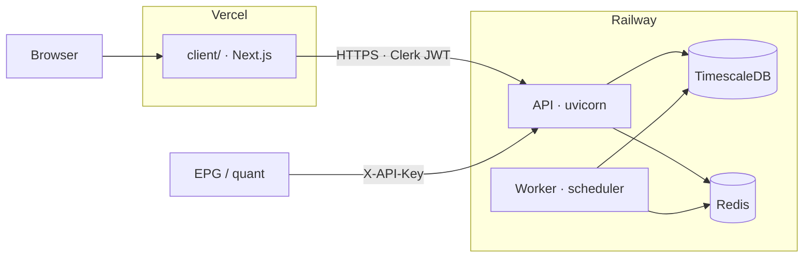
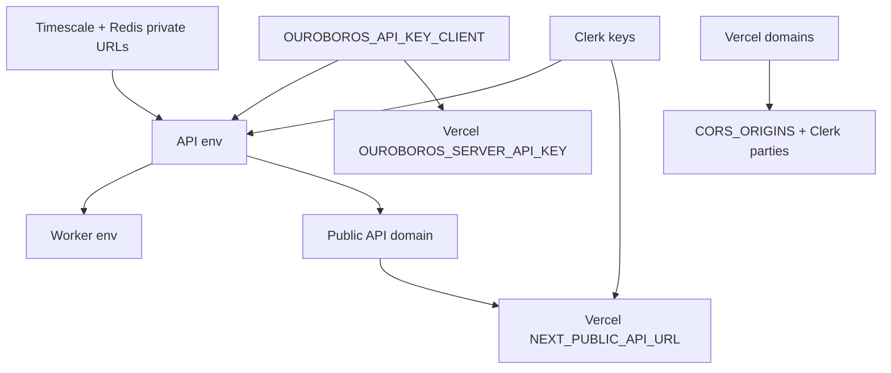

# Ouroboros — Deployment Guide

> **Hosts:** Railway (API · worker · TimescaleDB · Redis) · Vercel (Next.js client)  
> **Companion:** walking-skeleton notes in [`ops/railway/STAGING.md`](./ops/railway/STAGING.md) · full report in [`roadmap.md`](./roadmap.md)  
> **Rule:** never commit secrets — set them in the host dashboards / CLI only.



---

## Linked projects (this machine)

| Host | Project | ID / notes |
| --- | --- | --- |
| **Railway** | `ouroboros` | `d83a15ce-0089-4573-a4fd-689540f70ae3` · workspace `atlas00000's Projects` · env `production` |
| **Vercel** | `ouroboros-client` | `prj_EcnCoYvWYiwcTSwLy4nrS7LKmfL9` · linked from `client/` |

**Live API (Railway):** https://api-production-0ecfe.up.railway.app  
**Live Client (Vercel):** https://ouroboros-client.vercel.app  

Smoke: `GET /v1/health` → postgres + redis `ok` · client production deploy `READY` (HTTP 200)

### Current deploy status (as of 2026-10-02)

| Layer | Status | Notes |
| --- | --- | --- |
| Railway `timescale` / `Redis` / `api` / `worker` | **Live** | API health ok; migrations applied |
| Railway DB seed | **Restored** | Full dump `ouroboros_full_20261002T145703Z.dump` → Timescale (~10.2M prices, 533 news, 15 assets). `max(prices.ts)` ≈ 2026-09-21 — gap-fill via MT5 when ready. |
| Vercel `ouroboros-client` | **Live** | Production alias `ouroboros-client.vercel.app` |
| Browser → API CORS | **Wired** | `CORS_ORIGINS=http://localhost:3000,https://ouroboros-client.vercel.app` · same on `CLERK_AUTHORIZED_PARTIES` |
| SSR machine key | **Wired** | Vercel `OUROBOROS_SERVER_API_KEY` ↔ Railway `OUROBOROS_API_KEY_CLIENT` |
| **Clerk (human auth)** | **Deferred** | Set later on Vercel + Railway. Sign-in URL stubs exist; Clerk keys remain empty until then. |

When Clerk is ready: add keys to both hosts, expand CORS/`CLERK_AUTHORIZED_PARTIES` for any custom domains, then `cd client && vercel --prod` (and redeploy Railway `api` if API Clerk env changed).

```bash
railway status                 # repo root → ouroboros
curl -sS https://api-production-0ecfe.up.railway.app/v1/health
vercel whoami
vercel link --cwd client       # already linked to ouroboros-client
```

### Railway services (deployed)

| Service | Role | Source / notes |
| --- | --- | --- |
| `timescale` | TimescaleDB PG16 | image `timescale/timescaledb:latest-pg16` · volume `/var/lib/postgresql/data` · **`PGDATA=/var/lib/postgresql/data/pgdata`** (required — avoids `lost+found` initdb failure) |
| `Redis` | Cache + Streams | Railway Redis plugin · `${{Redis.REDIS_URL}}` |
| `api` | FastAPI | Dockerfile `server/Dockerfile` · public domain above · start via `sh -c '… ${PORT:-8000}'` |
| `worker` | APScheduler | Same image · start `python -m app.scheduler` |

Private DNS: `timescale.railway.internal` · `redis.railway.internal`

### Gotchas learned on first deploy

1. **Force Dockerfile** — empty services default to Railpack/Node; set `dockerfilePath=server/Dockerfile` (repo-root [`railway.toml`](./railway.toml)).
2. **Timescale volume** — set `PGDATA` to a subdirectory under the mount, not the mount root.
3. **`$PORT`** — Railway does **not** expand bare `$PORT` in startCommand; use `sh -c 'uvicorn … --port ${PORT:-8000}'` (or rely on the image `CMD`).
4. **Config as Code** — `railway.toml` still works until 2026-12-01; prefer migrating to `.railway/railway.ts` when convenient (`railway config migrate`).
5. Never put DB passwords in git — local temp `.railway-timescale-password.tmp` is gitignored.
6. **Dump restore + Timescale versions** — local dump catalog may lag `latest-pg16` on Railway (e.g. 2.30.0 → 2.30.2). After `pg_restore`, run `timescaledb_post_restore()`; if catalog mismatch, sync `_timescaledb_catalog.metadata` `timescaledb_version` to the server extension, then post-restore. Prefer pinning both sides to the same tag for future restores. Use a temporary TCP proxy for `pg_restore`, then remove it.

---

## 0. Prerequisites

| Tool / account | Why |
| --- | --- |
| Railway CLI + Vercel CLI | Linked above (`npm i -g @railway/cli vercel`) |
| GitHub repo (optional later) | Continuous deploy from `main` / Vercel previews |
| [Clerk](https://clerk.com) application | Human auth (invite-only org) — **configure later**; not required for current SSR/API-key desk path |
| Optional: Resend, Sentry, LLM keys | Email alerts, errors, generative tier |

**Local verify before / beside cloud deploy:**

```bash
docker-compose up -d
python scripts/test_phase0.py --quick
cd client && pnpm build
```

---

## 1. Railway — provision (CLI)

From the **repo root** (already `railway link`ed):

```bash
# Data plane
railway add --database redis --json
railway add --image timescale/timescaledb:latest-pg16 --service timescale \
  --variables "POSTGRES_USER=ouroboros" \
  --variables "POSTGRES_DB=ouroboros" \
  --variables "POSTGRES_PASSWORD=<strong-secret>" \
  --json

railway service link timescale
railway volume add --mount-path /var/lib/postgresql/data --json
railway service redeploy --service timescale --yes

# App plane (empty shells)
railway add --service api --json
railway add --service worker --json
```

> Do **not** use Railway’s plain Postgres plugin — migrations need Timescale hypertables.

### 1.1 Wire shared URLs

On `timescale`, set a shareable URL (password matches `POSTGRES_PASSWORD`):

```text
DATABASE_URL=postgresql://ouroboros:<password>@timescale.railway.internal:5432/ouroboros
```

On `api` and `worker`, prefer references (no duplicated secrets):

```bash
railway variable set 'DATABASE_URL=${{timescale.DATABASE_URL}}' --service api --skip-deploys
railway variable set 'REDIS_URL=${{Redis.REDIS_URL}}' --service api --skip-deploys
railway variable set APP_ENV=production LOG_LEVEL=INFO CORS_ORIGINS=http://localhost:3000 \
  DB_POOL_SIZE=10 DB_MAX_OVERFLOW=20 --service api --skip-deploys

railway variable set 'DATABASE_URL=${{timescale.DATABASE_URL}}' --service worker --skip-deploys
railway variable set 'REDIS_URL=${{Redis.REDIS_URL}}' --service worker --skip-deploys
railway variable set APP_ENV=production LOG_LEVEL=INFO DB_POOL_SIZE=10 DB_MAX_OVERFLOW=20 \
  --service worker --skip-deploys
```

Add Clerk / Resend / bootstrap API keys when ready (see §2.1). **Never** set `CLERK_TEST_JWT_SECRET` on Railway.

---

## 2. Railway — API deploy

Config-as-code: [`server/railway.toml`](./server/railway.toml)

| Setting | Value |
| --- | --- |
| **Root Directory** | Repository **root** (so `packages/contracts` is in the Docker build context) |
| **Builder** | Dockerfile |
| **Dockerfile path** | `server/Dockerfile` |
| **Start** | `sh -c 'uvicorn app.main:app --host 0.0.0.0 --port ${PORT:-8000}'` |
| **Release** | `python -m alembic upgrade head` (also `preDeployCommand`) |
| **Healthcheck** | `GET /v1/health/live` |

### 2.1 Environment variables (API)

Copy from [`server/.env.example`](./server/.env.example). Minimum for a healthy API:

| Variable | Notes |
| --- | --- |
| `APP_ENV` | `production` (or `staging`) |
| `DATABASE_URL` | `${{timescale.DATABASE_URL}}` |
| `REDIS_URL` | `${{Redis.REDIS_URL}}` |
| `CORS_ORIGINS` | Comma-separated Vercel + `http://localhost:3000` |
| `CLERK_*` | **Deferred** — add when Clerk is configured; until then leave empty |
| `OUROBOROS_API_KEY_CLIENT` | Bootstrap key → also Vercel `OUROBOROS_SERVER_API_KEY` (**set**) |
| `RESEND_*` / `SENTRY_*` / feed & LLM keys | As those tiers go live |

### 2.2 Deploy from CLI

```bash
# From repo root — uploads build context, uses server/railway.toml when linked as config
railway up --service api --detach -y
railway domain --service api --json          # public HTTPS hostname
railway logs --service api --deployment
```

Smoke:

```bash
curl -sS https://<api-domain>/v1/health
curl -sS https://<api-domain>/v1/health/live
```

Expect postgres + redis `ok` on `/v1/health`.

### 2.3 Continuous deploy (optional)

Connect GitHub on the `api` service (`railway service source connect --repo <owner>/<repo> --branch main --service api`) or enable auto-deploy in the dashboard. Release command runs migrations **before** traffic cutover.

---

## 3. Railway — worker service

1. Same Dockerfile / build as `api`.
2. **Start command:** `python -m app.scheduler` (set in dashboard or via config file [`server/railway.worker.toml`](./server/railway.worker.toml) when that service uses it).
3. Share `DATABASE_URL` + `REDIS_URL` (and most server env). **No** second Alembic release command.
4. Deploy:

```bash
railway up --service worker --detach -y
# then ensure startCommand is python -m app.scheduler (dashboard if needed)
```

No public domain required.

---

## 4. Vercel — client

Config: [`client/vercel.json`](./client/vercel.json) · Dockerfile is local/compose only.

### 4.1 Project

Already created/linked as **`ouroboros-client`**. For Git-connected monorepo deploys set **Root Directory = `client`**.

```bash
cd client
vercel link --yes --project ouroboros-client   # if needed
vercel env pull                                # optional
```

### 4.2 Environment variables (Vercel)

From [`client/.env.example`](./client/.env.example):

| Variable | Scope | Notes |
| --- | --- | --- |
| `NEXT_PUBLIC_API_URL` | Production · Preview · Development | Railway **public** API HTTPS URL (no trailing slash) |
| `NEXT_PUBLIC_CLERK_PUBLISHABLE_KEY` | All | **Deferred** — set with Clerk later |
| `CLERK_SECRET_KEY` | All | **Deferred** — set with Clerk later |
| `NEXT_PUBLIC_CLERK_SIGN_IN_URL` | All | `/sign-in` (**set**) |
| `NEXT_PUBLIC_CLERK_SIGN_UP_URL` | All | `/sign-up` (**set**) |
| `OUROBOROS_SERVER_API_KEY` | Production · Preview · Development | Same plaintext as Railway `OUROBOROS_API_KEY_CLIENT` (**set**) |
| `NEXT_PUBLIC_SENTRY_DSN` | Optional | Client errors |
| `NEXT_PUBLIC_LOG_LEVEL` | Optional | `info` default |

Redeploy after changing `NEXT_PUBLIC_*` (inlined at build time).

### 4.3 Clerk checklist (later)

Clerk is **not** required for the current live stack (SSR uses the machine API key). When you enable human login:

1. Create invite-only Clerk org; disable public sign-up for production.
2. Set on **Vercel**: `NEXT_PUBLIC_CLERK_PUBLISHABLE_KEY`, `CLERK_SECRET_KEY` (all envs) → `vercel --prod`.
3. Set on **Railway `api`**: `CLERK_SECRET_KEY`, `CLERK_JWKS_URL`, `CLERK_ALLOWED_ORG_ID`; keep `CLERK_AUTHORIZED_PARTIES` aligned with client origins.
4. Add Vercel production + preview URLs in Clerk allowed origins / redirects.
5. Mirror any new custom domains into Railway `CORS_ORIGINS` and `CLERK_AUTHORIZED_PARTIES`.

### 4.4 Deploy

```bash
cd client && vercel --prod
# or connect GitHub → Production branch = main
```

---

## 5. Cross-wire checklist



| Step | Done when |
| --- | --- |
| DB + Redis healthy | API `/v1/health` shows both `ok` |
| Migrations applied | Release logs show `alembic upgrade head` success |
| Worker running | Scheduler logs without crash loop |
| CORS + Clerk | Browser can call API; no CORS errors |
| SSR key | RSC / `/api/*` succeed without browser JWT |
| No secrets in git | Only `.env.example` committed · ignore `.railway*` password temps |

---

## 6. Environments matrix

| Piece | Local | Cloud (current) |
| --- | --- | --- |
| Client | `pnpm dev` / compose `--profile client` | Vercel `ouroboros-client` |
| API | `uvicorn` / compose `--profile server` | Railway service `api` |
| Worker | `python -m app.scheduler` | Railway service `worker` |
| DB / Redis | compose ports 5433 / 6380 | `timescale` + `Redis` (private) |
| `APP_ENV` | `local` | `production` |
| `NEXT_PUBLIC_API_URL` | `http://localhost:8000` | `https://<api-domain>` |

Prefer a separate Railway/Vercel staging project later so secrets and data never mix with production.

---

## 7. Rollback & ops

| Situation | Action |
| --- | --- |
| Bad API deploy | `railway deployment list --service api` → redeploy previous; schema is forward-only |
| Bad client deploy | Vercel → promote previous / revert git |
| Feed stale | [`docs/runbooks/feed-down.md`](./docs/runbooks/feed-down.md) |
| Restore drill | [`docs/runbooks/restore-from-backup.md`](./docs/runbooks/restore-from-backup.md) |

```bash
railway open
railway logs --service api
railway logs --service worker
railway service status --json
```

---

## 8. File map (deploy-relevant)

| Path | Role |
| --- | --- |
| [`server/Dockerfile`](./server/Dockerfile) | API + worker image (monorepo context) |
| [`server/railway.toml`](./server/railway.toml) | API build / start / release / health |
| [`server/railway.worker.toml`](./server/railway.worker.toml) | Worker start command reference |
| [`server/.env.example`](./server/.env.example) | Server env template |
| [`.dockerignore`](./.dockerignore) | Slim Railway/server build context |
| [`client/vercel.json`](./client/vercel.json) | Vercel install/build |
| [`client/Dockerfile`](./client/Dockerfile) | Local/compose only |
| [`client/.env.example`](./client/.env.example) | Client env template |
| [`ops/railway/STAGING.md`](./ops/railway/STAGING.md) | Original walking-skeleton checklist |

---

## 9. Quick command card

```bash
# --- Local parity ---
docker-compose up -d
cd server && alembic upgrade head && uvicorn app.main:app --host 0.0.0.0 --port 8000
cd client && pnpm build && pnpm start

# --- Railway (linked project ouroboros) ---
railway status
railway up --service api --detach -y
railway up --service worker --detach -y   # startCommand = python -m app.scheduler
curl -sS https://api-production-0ecfe.up.railway.app/v1/health

# --- Vercel ---
cd client && vercel --prod
# set NEXT_PUBLIC_API_URL=https://api-production-0ecfe.up.railway.app
```
