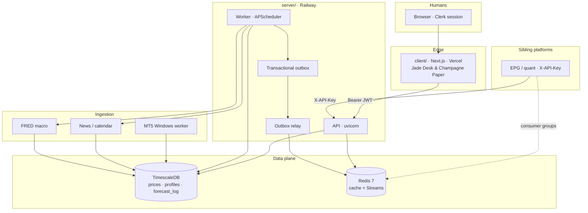
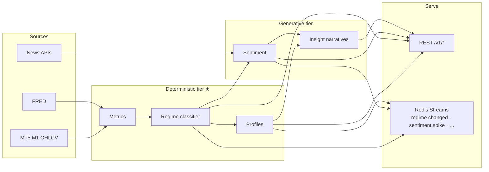
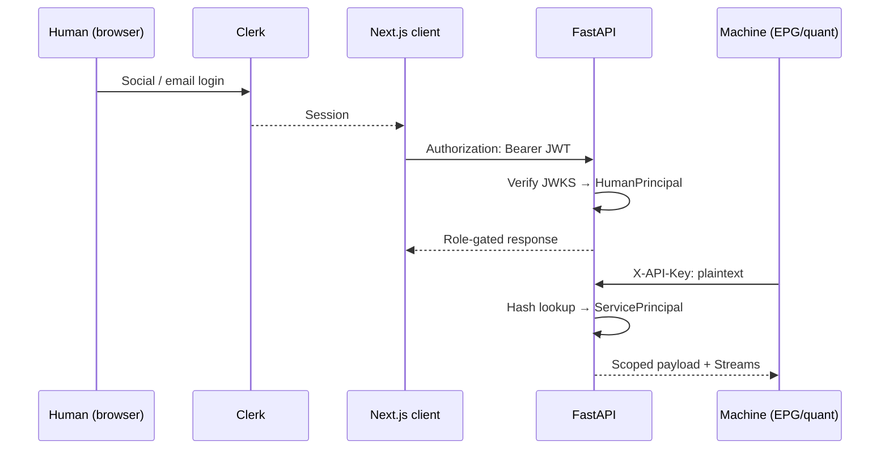
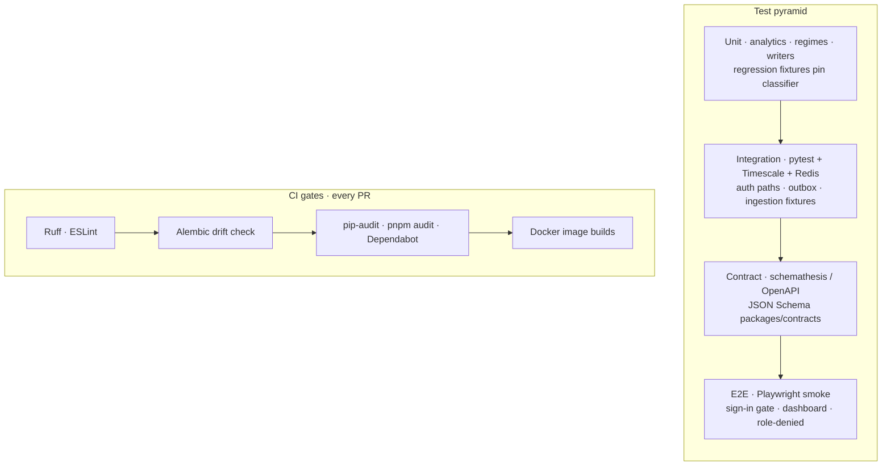
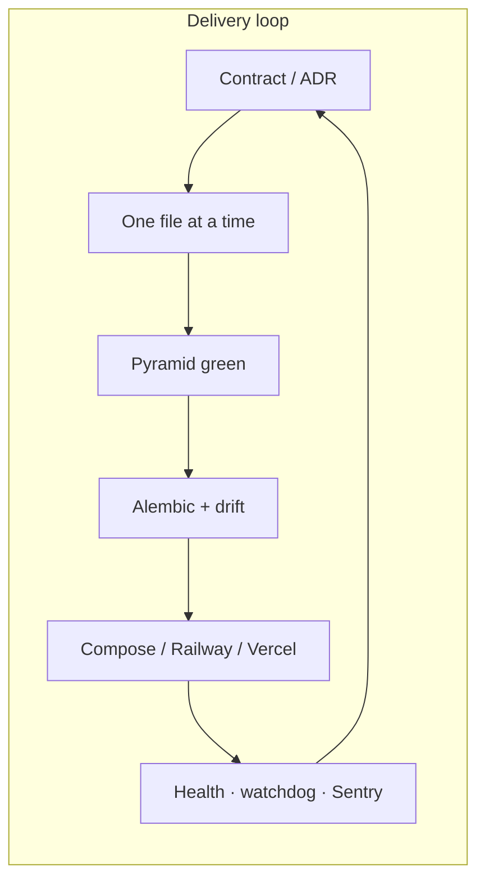
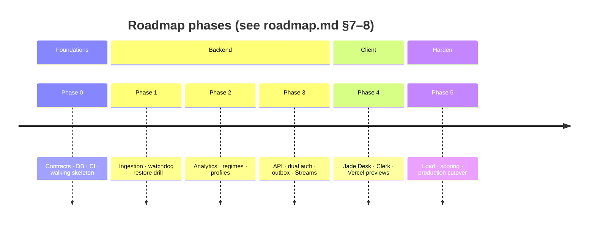

<p align="center">
  
</p>

<h1 align="center">Ouroboros</h1>

<p align="center">
  <strong>Independent asset intelligence</strong> — market data → living profiles, regimes, sentiment &amp; insights → sibling platforms.<br/>
  <em>Research context only. It does not execute trades.</em>
</p>

<p align="center">
  <a href="#-system-map">System map</a> ·
  <a href="#-data--intelligence-pipeline">Pipeline</a> ·
  <a href="#-dual-auth">Auth</a> ·
  <a href="#-testing--quality">Testing</a> ·
  <a href="#-industry-best-practices">Practices</a> ·
  <a href="#-local-quick-start">Quick start</a> ·
  <a href="./docs/features/features.md">Features</a> ·
  <a href="./DEPLOYMENT.md">Deploy</a> ·
  <a href="./roadmap.md">Full report</a>
</p>

---

> **Report companion** — this README is the visual front door to the project report & roadmap ([`roadmap.md`](./roadmap.md) v1.6). **Capabilities** (live · partial · planned) live in [`docs/features/features.md`](./docs/features/features.md). Decisions and week-by-week delivery stay in the roadmap; day-to-day orientation starts here.

| Deployable | Host | Path |
| --- | --- | --- |
| **Client** (Next.js 16 · Jade Desk UI) | Vercel | [`client/`](./client/) |
| **API + worker** (FastAPI · same image, two entrypoints) | Railway | [`server/`](./server/) |
| **Postgres / Timescale + Redis** | Railway (prod) · Docker (local) | [`docker-compose.yml`](./docker-compose.yml) |
| **Shared contracts** (`profile.v1`, `state.v1`, …) | Package | [`packages/contracts/`](./packages/contracts/) |

**Auth:** Clerk (humans) · hashed API keys (machines) · **Email:** Resend · **Events:** transactional outbox → Redis Streams

---

## ◎ What it produces

| Output | Intent |
| --- | --- |
| **Asset profiles** | Living, versioned dossiers (identity, vol character, peers, correlations) |
| **Market states & regimes** | `trending_up` / `trending_down` / `ranging` / `high_volatility` + probabilities |
| **Metrics** | Realized vol, ATR percentiles, trend strength, correlation matrices |
| **News & sentiment** | Decay-weighted scores with driver headlines |
| **Insights** | LLM narratives labeled generative — never fed into numeric fields |
| **Honest provenance** | Every envelope: `sources[]`, `generated_at`, `model_version`, `confidence`, `stale` |

### Explicit non-goals

- No trade execution, order routing, or position management — ever
- No public/external subscribers in v1 (internal research tool)
- No tick-level infra in v1 (1-minute bars)

---

## ◎ System map



**Hard split:** `client/` and `server/` are independent deployables (own Dockerfiles, env, lockfiles). They share only contracts + OpenAPI — never cross-imports.

---

## ◎ Data & intelligence pipeline



Numbers stay in tested, reproducible code (`server/app/analytics/`). Words come from LLMs (`server/app/intelligence/`) and are labeled `type: narrative`. LLM output **cannot** enter a numeric field.

---

## ◎ Dual auth



| Principal | Credential | Roles / notes |
| --- | --- | --- |
| Human | Clerk JWT | `viewer` · `analyst` · `ops` · `admin` (invite-only org) |
| Machine | Hashed API key | Service name + role; **never** embedded in the browser bundle |

See [ADR-015](./docs/adr/015-dual-auth-clerk-and-api-keys.md).

---

## ◎ Testing & quality

Industry-style test pyramid — automated from commit to image — plus honesty checks that keep the desk trustworthy.



### What runs where

| Layer | Command | Covers |
| --- | --- | --- |
| **Phase 0 suite** | `python scripts/test_phase0.py --quick` | Structure, compose, migrate, ruff, drift, contracts, server pytest ([docs](./docs/phase0-testing.md)) |
| **Phase 1 suite** | `py -3.12 scripts/test_phase1.py --skip-live` | Ingestion modules, watchdog, backups, optional live/MT5 ([docs](./docs/phase1-testing.md)) |
| **Server** | `cd server && pytest -q` | API, auth, analytics, scoring, ops |
| **Contracts** | `cd packages/contracts && pytest -q` | Schema round-trips + JSON Schema export |
| **Client build** | `cd client && pnpm build` | Next production compile + TypeScript |
| **Client E2E** | `cd client && pnpm test:e2e` | Playwright smoke (CI with Chromium) |
| **GitHub Actions** | [`.github/workflows/ci.yml`](./.github/workflows/ci.yml) | Server · contracts · client jobs in parallel |

### Quality bar (from the report)

| Practice | How we enforce it |
| --- | --- |
| Migration-first DB | Alembic only; CI **drift check** fails on model/migration skew |
| Contract-first APIs | Versioned schemas (`profile.v1`); RFC 9457 problem+json; cursor pagination |
| Deterministic / generative split | Guardrail tests: narratives never mutate numeric fields |
| Provenance honesty | `stale`, `generated_at`, `model_version` on envelopes; watchdog on feeds |
| Supply-chain | Dependabot + audits from Week 1 — not bolted on at cutover |
| Walking skeleton | Staging health live early; infra surprises arrive one at a time |

---

## ◎ Industry best practices

Condensed from [roadmap §6](./roadmap.md#6-industry-best-practices-adopted):

| # | Practice | One-liner |
| --- | --- | --- |
| 6.1 | **Migration-first governance** | Every schema change is an Alembic revision; expand–contract + `lock_timeout` for live markets |
| 6.2 | **Contract-first integration** | Shared package is source of truth; break → `v2`, never mutate `v1` |
| 6.3 | **Two-tier AI** | Numbers tested & reproducible; LLM = labeled narrative only |
| 6.4 | **Provenance & observability** | Watchdog watches *data*; Sentry + `/metrics` watch *system* |
| 6.5 | **12-factor + dual auth** | Env-driven secrets; Clerk humans / hashed keys for machines |
| 6.6 | **Walking skeleton** | Continuous deploy from Week 1; UI hugs a live API |
| 6.7 | **Modular single-file workflow** | One module per file; implement one file at a time |
| 6.8 | **Hard deploy boundaries** | Separate Dockerfiles; API ≠ worker entrypoint |
| 6.9 | **Durable eventing** | Same TX as state change → outbox → Redis Streams (acks + replay) |
| 6.10 | **ADRs** | Significant choices recorded in [`docs/adr/`](./docs/adr/) |



---

## ◎ Local quick start

### 1 — Infra (always)

```bash
docker-compose up -d
# Postgres → localhost:5433 · Redis → localhost:6380
```

### 2 — Env templates (never commit secrets)

```bash
# Windows
copy server\.env.example server\.env
copy client\.env.example client\.env.local
```

### 3 — Native apps

```bash
# Server
cd server
python -m pip install -e ".[dev]"
alembic upgrade head
uvicorn app.main:app --reload --port 8000

# Client (second terminal)
cd client
pnpm install
pnpm dev
```

### 4 — Full Docker (optional)

```bash
# Build once (legacy builder if BuildKit is broken locally)
set DOCKER_BUILDKIT=0
docker build -f server/Dockerfile -t ouroboros-server:local .
docker build -f client/Dockerfile -t ouroboros-client:local ./client

docker-compose --profile server --profile client up -d
```

Cloud deploy (Railway API/DB + Vercel client): see **[`DEPLOYMENT.md`](./DEPLOYMENT.md)**.

| Check | URL |
| --- | --- |
| API health | http://localhost:8000/v1/health |
| OpenAPI | http://localhost:8000/docs |
| Desk UI | http://localhost:3000 |

### Verify

```bash
python scripts/test_phase0.py --quick
cd client && pnpm build
```

---

## ◎ Phases at a glance



| Phase | Theme | Status docs |
| --- | --- | --- |
| 0 Foundations | Contracts, migrations, CI, staging health | [`docs/phase0-testing.md`](./docs/phase0-testing.md) |
| 1 Ingestion | MT5, news, macro, watchdog | [`docs/phase1-testing.md`](./docs/phase1-testing.md) · [`docs/status/`](./docs/status/) |
| 2–3 Analytics → API | Regimes, dual auth, events | Weekly notes in `docs/status/` |
| 4 Client | Desk UI against live API | [`docs/UIscreens-and-details.md`](./docs/UIscreens-and-details.md) · [`client/UI_PHILOSOPHY.md`](./client/UI_PHILOSOPHY.md) |

---

## ◎ Documentation map

| Doc | Role |
| --- | --- |
| [`DEPLOYMENT.md`](./DEPLOYMENT.md) | **Railway + Vercel deploy steps** (API, worker, DB, Redis, client) |
| [`roadmap.md`](./roadmap.md) | **Project report** + full implementation roadmap |
| [`concept.md`](./concept.md) | Product concept seed |
| [`docs/architecture.md`](./docs/architecture.md) | Architecture stub |
| [`docs/data-contracts.md`](./docs/data-contracts.md) | Contract notes |
| [`docs/adr/`](./docs/adr/) | Architecture decision records |
| [`docs/logging.md`](./docs/logging.md) | Structured logging |
| [`ops/railway/STAGING.md`](./ops/railway/STAGING.md) | Railway walking skeleton |
| [`client/UI_PHILOSOPHY.md`](./client/UI_PHILOSOPHY.md) | Jade Desk & Champagne Paper |

---

## ◎ Success criteria

1. **Freshness** — 99% of price data &lt; 2 minutes old in market hours; zero silent staleness
2. **Regime quality** — labels pass agreed human/backtest threshold; flip-rate within noise budget
3. **Adoption** — EPG or a quant platform consumes ≥ 1 Ouroboros feed in a real workflow

---

## License

Private — internal use.
