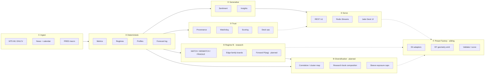
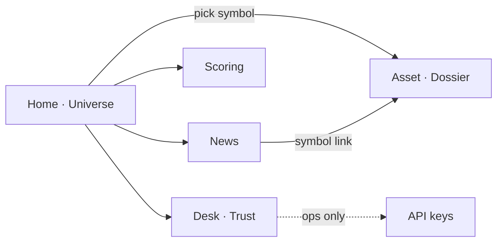
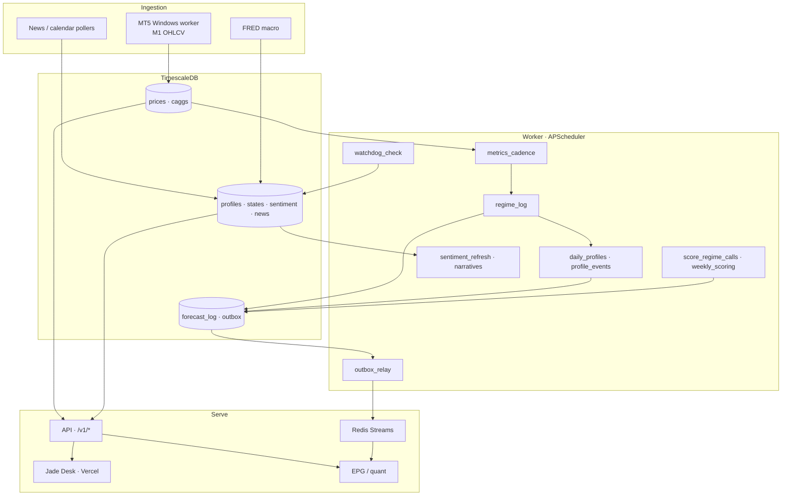
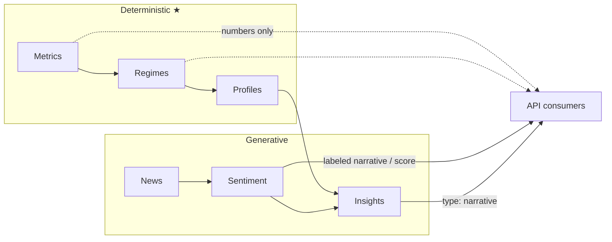
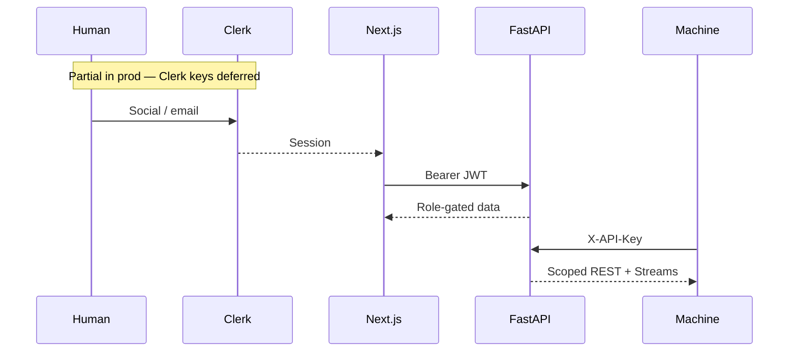
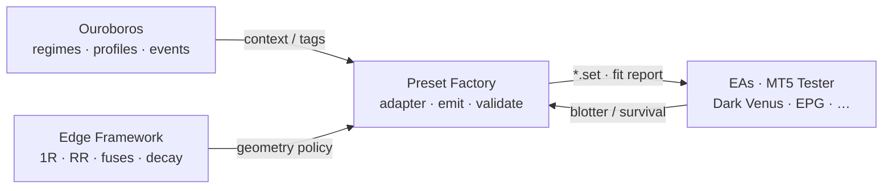

# Ouroboros — Features & Capabilities

> **Role:** Living source of truth for what the product can do — shipped, partial, and planned.  
> **Audience:** product · eng · sibling platforms (EPG / quant)  
> **Companions:** [`roadmap.md`](../../roadmap.md) (decisions & delivery) · [`preset-factory-roadmap.md`](../../preset-factory-roadmap.md) (sibling factory) · [feature-class briefs](./) · [`Asset profile.md`](./Asset%20profile.md) · [`docs/pages.md`](../pages.md) (UI IA) · [`DEPLOYMENT.md`](../../DEPLOYMENT.md) (hosts) · [`docs/data-contracts.md`](../data-contracts.md)  
> **Last reviewed:** 2026-10-06

Ouroboros is an **independent asset-intelligence desk**: market + news → living profiles, regimes, sentiment, and insights → sibling platforms. **Research / advisory only — it never executes trades.**

---

## How to maintain

| Change | Update here |
| --- | --- |
| Ship or cut a capability | Status in **Capability map** + short note in **Changelog** |
| Add/remove a page or API route | **Surfaces** tables |
| New worker job / event type | **Background jobs** / **Events** |
| Deferred → live (e.g. Clerk) | Flip status; drop “partial” caveats |

**Status key**

| Tag | Meaning |
| --- | --- |
| `live` | Usable today (local and/or Railway + Vercel) |
| `partial` | Code or chrome exists; not fully configured in prod |
| `planned` | Roadmap intent — not shipped or not activated |

---

## Capability map

Eight domains — left to right is the product flow; Trust cross-cuts Serve; Regime fit and diversification feed the sibling Preset Factory.

### At a glance

| Domain | Capability | Status | Notes |
| --- | --- | --- | --- |
| **Ingest** | MT5 M1 live + historical backfill | `live` | Windows worker (`ops/mt5-worker/`); Railway DB seeded from local dump |
| | News + economic calendar | `live` | Finnhub-class sources; high-impact flagging |
| | FRED macro series | `live` | Daily cadence via worker / pollers |
| | Source registry + heartbeats | `live` | Cadence expectations per feed |
| **Calendar** | UTC storage · sessions · MT5 offset/DST | `live` | `app/calendar/` |
| **Metrics** | Realized vol, ATR%, ER trend, returns, correlations | `live` | Timeframes **M1 · M15 · H1 · H4 · D1** · `metrics.v1` |
| | True bid/ask spread / liquidity | `planned` | Range proxies only in v1 |
| **Regimes** | Rule classifier + soft probabilities | `live` | `regimes.rule_v1` · 4 regimes · persistence / hysteresis |
| | HMM classifier in production | `planned` | Spike done; **not** promoted (ADR-017) |
| **Regime fit tags** | MATCH / MISMATCH / FRAGILE vs edge family | `live` | `fit.map_v0` · boards · live gate · `GET /v1/fit` · `fit_log` · Desk asset overlay · fit stickiness scoring |
| | Forward probabilistic tags `P(tag)` @ 7d/30d/60d | `planned` | Factory Phase 4b — after scoring beats persistence |
| **Profiles** | Daily + event-triggered living dossiers | `live` | Retention 180d; event sensitivities; Desk dossier — see [`Asset profile.md`](./Asset%20profile.md) |
| **Sentiment** | Decay-weighted [-1,+1] + driver headlines | `live` | Per-article cache; interval via env |
| **Insights** | LLM narratives (`type: narrative` only) | `live` | Never writes numeric fields; budget-aware |
| **API** | Versioned REST under `/v1` | `live` | problem+json · cursor pagination · provenance |
| | Dual auth: Clerk JWT + API keys | `partial` | Keys `live`; **Clerk deferred** in prod (stubs exist) |
| **Events** | Outbox → Redis Streams | `live` | `regime.changed` · `sentiment.spike` · `news.high_impact` · `profile.updated` |
| **Scoring** | Forecast log + weekly accuracy | `live` | Regime stickiness + fit stickiness vs persistence; UI `/scoring` |
| **Watchdog** | Stale propagation + ops alerts | `live` | Resend path built; channel selectable |
| **Desk UI** | Home · Asset · News · Scoring · Desk | `live` | Vercel `ouroboros-client`; Asset fit overlay live |
| | Invite-only Clerk org in prod | `partial` / `planned` | Wire keys when ready |
| **Admin** | Mint / revoke machine API keys | `live` | Admin+; plaintext once |
| **Ops** | Feed registry · watchdog · pipe summary | `live` | `/system` role-gated |
| **Backup** | Full + targeted dumps · restore drill | `live` | RPO prices ≤24h · irreplaceable ≤1h |
| **Deploy** | Railway API/worker/DB/Redis · Vercel client | `live` | See `DEPLOYMENT.md` |
| **Consumers** | Sibling platform pilot (EPG / quant) | `planned` | Keys + Streams ready; adoption is Phase 5 |
| **Preset Factory** | Emit EF-aligned `.set` / JSON from system profile | `planned` | Sibling tooling — reads Ouroboros; never executes |
| | Geometry policy v0 + Dark Venus / EPG emitters | `planned` | See [`preset-factory-roadmap.md`](../../preset-factory-roadmap.md) |
| **Diversification engine** | Research book composition vs correlation / fit clusters | `planned` | Later — caps stacked USD-fade exposure; feeds Factory, never executes |
| **Non-goals** | Trade execution · public subscribers · ticks | — | Explicit forever / v1 · factory shares the same line |

---

## Surfaces

### Client (Jade Desk)

| Page | Route | Job | Status |
| --- | --- | --- | --- |
| **Home** | `/` | Universe scan — pulse, instruments, signal desk | `live` |
| **Asset** | `/assets/[symbol]` | Living dossier — price/regime, profile, sentiment, insights | `live` |
| **News** | `/news` | Filterable headlines + calendar context | `live` |
| **Scoring** | `/scoring` | Regime-call honesty over time | `live` |
| **Desk** | `/system` | Freshness, feeds, watchdog (ops/admin) | `live` |
| Sign-in / Sign-up | `/sign-in` · `/sign-up` | Clerk chrome | `partial` |

Nav: `Home` · `News` · `Scoring` · `Desk` — Asset entered from Home or deep link.  
Detail: [`docs/pages.md`](../pages.md).

### REST API (`/v1`)

| Area | Endpoints | Auth | Status |
| --- | --- | --- | --- |
| Health | `GET /health` · `/health/live` | Public | `live` |
| Universe | `GET /assets` · `/assets/{symbol}/profile` | Protected | `live` |
| Market | `GET /state` · `/metrics` · `/bars` | Protected | `live` |
| Context | `GET /news` · `/sentiment` · `/insights` | Protected | `live` |
| Honesty | `GET /scoring/weekly` | Protected | `live` |
| Ops | `GET /ops/registry` · `/ops/watchdog` · `/ops/summary` | Admin+ | `live` |
| Admin | `GET/POST /admin/keys` · revoke | Admin+ | `live` |

Protected = Clerk JWT **or** `X-API-Key`. Browser never holds machine keys.

### Contracts & events

| Contract | Purpose | Status |
| --- | --- | --- |
| `profile.v1` | Living asset dossier | `live` |
| `state.v1` | Regime + probabilities | `live` |
| `sentiment.v1` | Score + drivers | `live` |
| `insight.v1` | Labeled narrative | `live` |
| `events.v1.*` | Stream envelopes | `live` |

Every payload carries **provenance**: `sources[]` · `generated_at` · `model_version` · `confidence` · `stale`.

---

## End-to-end flow

### Two-tier intelligence

Numbers are tested and reproducible. LLM output is labeled and **cannot** enter numeric fields.

---

## Background jobs (worker)

| Job | Cadence (typical) | Purpose | Status |
| --- | --- | --- | --- |
| `metrics_cadence` | Interval | Refresh deterministic metrics | `live` |
| `regime_log` | Interval | Classify + immutable forecast log | `live` |
| `profile_events` | Interval | Event-triggered profile refresh | `live` |
| `daily_profiles` | Cron ~00:15 UTC | Full daily dossier rebuild | `live` |
| `prune_profiles` | Daily cron | 180d retention policy | `live` |
| `sentiment_refresh` | `SENTIMENT_INTERVAL_MINUTES` | Score unseen headlines | `live` |
| `narratives_refresh` | ~2× sentiment interval | Insight copy | `live` |
| `outbox_relay` | Seconds | DB outbox → Redis Streams | `live` |
| `watchdog_check` | Interval | Cadence / stale / alerts | `live` |
| `score_regime_calls` | Hourly | Compare calls vs realized | `live` |
| `weekly_scoring` | Mon 08:00 UTC | Weekly accuracy report (+ email hook) | `live` |

MT5 live poll / backfill runs on a **Windows host**, not inside Railway.

---

## Auth & roles

| Role | Desk access |
| --- | --- |
| `viewer` / `analyst` | Read assets, state, news, sentiment, insights, scoring |
| `ops` | + Desk (`/system`) feeds & watchdog |
| `admin` | + Mint/revoke machine API keys |

Until Clerk is wired in prod, machine API keys (and SSR server key) carry the desk path.

---

## Trust & honesty

| Mechanism | What it does | Status |
| --- | --- | --- |
| Provenance envelope | Every output: sources, time, model, confidence, stale | `live` |
| Staleness watchdog | Per-feed cadence → `stale: true` + alerts | `live` |
| Regime scoring | Immutable log + weekly accuracy UI (bar stickiness) | `live` |
| Regime fit audit | Ex-post MATCH / MISMATCH / FRAGILE boards + API shares | `live` | `fit.map_v0` / boards / `GET /v1/fit?window=` |
| Fit stickiness scoring | Score `fit.*` vs remapped realized tag; weekly vs persistence | `live` | `scoring.fit.v1` · `/scoring` fit block |
| Research disclaimer | Persistent in UI footer / insight surfaces | `live` |
| Backups & restore | Nightly full · hourly targeted · drilled restore | `live` |
| Email digests (Resend) | Watchdog / weekly scoring mail | `partial` | Needs domain + keys in each env |

---

## Hosting footprint

| Piece | Where | Status |
| --- | --- | --- |
| Client | Vercel (`ouroboros-client`) | `live` |
| API + worker | Railway (same image, two entrypoints) | `live` |
| Timescale + Redis | Railway | `live` (DB seeded 2026-10-02) |
| MT5 worker | Windows machine | `live` locally; point at Railway when gap-filling |
| Local Docker | Postgres · Redis · optional API/client profiles | Dev path |

Price freshness gap after seed: `max(prices.ts)` may lag — close with MT5 backfill against Railway `DATABASE_URL`.

---

## Regime fit tags & audit

> Full brief: [`Regime fit tags.md`](./Regime%20fit%20tags.md) · build plan: [`Regime fit tags roadmap.md`](./Regime%20fit%20tags%20roadmap.md)

Maps raw regimes (`trending_*` / `ranging` / `high_volatility`) onto a **declared edge family** (`meanrev` · `trendfollow` · …) so sibling systems can gate research books.

| Tag | Meaning (factory / research) |
| --- | --- |
| **MATCH** | Environment fits the family’s home cell |
| **MISMATCH** | Kill / adverse regime for that family |
| **FRAGILE** | Event / vol-cluster caution — size or pause |

| Layer | What exists | Status |
| --- | --- | --- |
| Nowcast | `regimes.rule_v1` + forecast log (label stickiness one bar later) | `live` |
| Fit map | `fit.map_v0` meanrev / trendfollow | `live` |
| Ex-post boards | Dominant-share over 7d / 30d / calendar_month + CLI | `live` |
| Live gate | `allow_on` iff MATCH (`live_fit` + API) | `live` |
| Fit API / log | `GET /v1/fit` · `forecast_log` `fit.*` · worker `fit_log` | `live` |
| Fit scoring | Stickiness on `fit.*` + weekly vs persistence baseline | `live` | `scoring.fit.v1` |
| Forward `P(tag)` | Probabilities @ 7d / 30d / 60d + drivers + calibration | `planned` (Ouroboros grow-into) |
| Desk UI for tags | Soft overlays on Asset dossier (+ hero chip) | `live` | Not a dedicated Fit page |

Honesty rule: today’s scoring is **stickiness**, not a calendar-month outlook. Monthly MATCH boards are **ex-post**. Forward-month hard tags stay research until they beat persistence baselines ([`preset-factory-roadmap.md`](../../preset-factory-roadmap.md) § scoring contract).

---

## Preset Factory (sibling)

Not an Ouroboros page. Thin layer that **reads** Ouroboros context + Edge Framework geometry and **emits** survivable tester/live presets. Full plan: [`preset-factory-roadmap.md`](../../preset-factory-roadmap.md).

| Capability | Status | Notes |
| --- | --- | --- |
| Probe: regime tags + monthly boards | `partial` | Dark Venus / Trend Catcher canvases |
| EF-G1 reference presets | `partial` | Manual emit; survival vs unbounded baseline proven |
| Geometry policy v0 freeze | `planned` | RR ≥ 1.5 · max legs · stop required · Friday |
| Contracts (`SystemProfile`, `PresetSpec`, …) | `planned` | Phase 1 |
| Automated `.set` emitter + golden tests | `planned` | Phase 2 (Dark Venus) → Phase 3 (EPG) |
| CLI / internal emit API | `planned` | Phase 4 |
| Forward-tag overlays for size/pause | `planned` | Phase 4b — after promotion gate |
| Decay / capital Stage 2–3 | `planned` | Phase 5 |
| Diversification engine (book composition) | `planned` | Reads corr + fit; constrains multi-symbol emit |

**Hard rules shared with Ouroboros:** no execution · never emit designed TP &lt; SL · factory success = survivable + auditable, not max backtest profit.

---

## Diversification engine (planned)

> **Status:** `planned` · research acceptance for now (e.g. meanrev Tier-1 FX books may share a USD cluster) · build after Factory emit path is real

Sibling research books that pass **per-symbol** meanrev/trendfollow fit can still be **one risk bet** when instruments co-move (e.g. EURUSD · GBPUSD · AUDUSD H1 ~30d ρ ≈ 0.65–0.83). The diversification engine is the layer that answers: *given correlations, regime-fit tags, and Edge Framework survival constraints, which symbol × sleeve set is an acceptable research / emit book?*

| Piece | Intent |
| --- | --- |
| **Cluster map** | Reuse live `metrics` / `profile.v1` correlations (+ optional rolling windows) to group symbols into co-movement clusters |
| **Book composer** | Propose multi-symbol research books with low intra-book ρ or explicit cluster caps (not “all MATCH = all ON”) |
| **Sleeve exposure** | Bound Harvest vs Survival (and later Factory emits) so Stage-3 MaxDD / ruin is evaluated on the **book**, not only per EA |
| **Fit-aware gate** | Prefer diversifiers that are still non-kill for the declared edge family; never override EF geometry floors |

**Consumers:** Preset Factory emit validation · Desk research (optional board) · sibling quant.  
**Non-goals:** portfolio optimisation for live capital, order routing, or treating low ρ as a profit claim.

---

## Planned & deferred (track here)

| Item | Priority | Dependency |
| --- | --- | --- |
| **Clerk prod** — invite-only org, human JWT path | High | Clerk app + Vercel/Railway keys |
| **MT5 → Railway continuity** — live poll + gap backfill | High | Windows worker + `DATABASE_URL` |
| **Sibling pilot** — ≥1 consumer on REST and/or Streams | High | Stable contracts (ready) |
| **Regime fit Desk overlays** — soft UI for MATCH/MISMATCH/FRAGILE | Done | Asset dossier + hero chip (`GET /v1/fit`) |
| **Fit stickiness scoring** — weekly vs persistence | Done | `scoring.fit.v1` on `/scoring` |
| **Preset Factory Phase 1–2** — contracts + Dark Venus emitter | High | [`preset-factory-roadmap.md`](../../preset-factory-roadmap.md) |
| **Diversification engine** — corr clusters + research book composition + sleeve exposure caps | Medium | After Factory Phase 1–2; uses profiles/metrics corr + fit tags |
| **Forward `P(tag)` layer** — 7d/30d/60d + calibration | Medium | Beat persistence; then factory soft overlay |
| **Resend in prod** — SPF/DKIM + alert allowlist | Medium | Domain + `RESEND_*` |
| **Sentry + Prometheus `/metrics` hardening** | Medium | Keys / scrape path |
| **True spread / liquidity** | Later | Bid/ask source |
| **HMM regimes in prod** | Later | Beat `regimes.rule_v1` (ADR-017) |
| **Public / external subscribers** | Out of v1 | Regulatory posture |
| **Tick-level infra** | Out of v1 | Consumer proof of need |
| **Trade execution** | Never | Non-goal (Ouroboros **and** Preset Factory) |

---

## Explicit non-goals

- No order routing, positions, or brokering (Ouroboros or Preset Factory)  
- No public investment-advice product in v1  
- No tick pipeline until a sibling platform proves the need  
- No LLM numbers — generative tier is narrative / sentiment only  
- No treating monthly MATCH or forward `argmax` as a profit guarantee  
- No Market-default presets with stop disabled “because WR looks high”  

---

## Changelog

| Date | Change |
| --- | --- |
| 2026-10-06 | Added **Diversification engine** (`planned`) — corr/fit-aware research book composition for Preset Factory |
| 2026-10-06 | Richer dossiers (event sensitivities + Desk profile surface); Desk fit overlays; fit stickiness scoring vs persistence |
| 2026-10-03 | Shipped Regime fit R0–R4 (`fit.map_v0`, boards, gate, `GET /v1/fit`, `fit_log`) |
| 2026-10-03 | Added **Regime fit tags** + **Preset Factory** (from [`preset-factory-roadmap.md`](../../preset-factory-roadmap.md)); capability map domains ⑥–⑦ |
| 2026-10-03 | Initial `features.md` — Jade Desk, `/v1` API, Railway+Vercel, Clerk deferred |
| 2026-10-02 | Railway DB restored from local full dump; desk charts/news fed from prod API |

---

*When in doubt: update this file in the same PR that ships or cuts a capability.*
